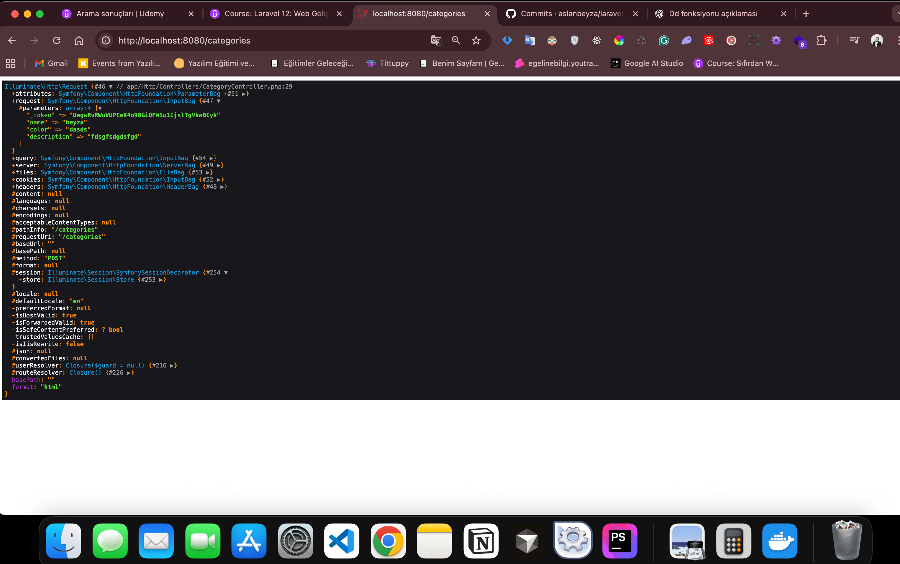

# Laravel Todo App

Sürekli `php artisan serve` demeyi tercih etmiyorum. Ben Docker ile kaldırıyorum ayağa projeyi. Docker ile kolayca projeyi ayağa kaldırmayı seviyorum. Taşıması da kolay oluyor aynı zamanda.

## Laravel Sail Kullanımı

O yüzden ben sail yazıyorum. Sail Laravel'in alt kütüphanesi. Sail ile tüm docker ayarlarını tek seferde yapabiliriz. Zaten dev ortamında indiriyorsunuz, sunucuya taşıyınca sizle birlikte gelmesine gerek yok.

### Kurulum

Projenin içinde iken:

```bash
composer require laravel/sail --dev
```

Bununla composer benim paketimi getiriyor. Ana GitHub reposundan indiriyor.

```bash
php artisan sail:install
```

Bu komut ise kuruyor onu.

### Çalıştırma

```bash
./vendor/bin/sail up
```

Bunu yazdığın zaman projen Docker üzerinden ayağa kalkacaktır.

```bash
./vendor/bin/sail up -d
```

Bu komut ile çalıştır artık. Şuan bu Docker üzerinden container üzerinden çalışıyor. `php artisan serve` dememe gerek kalmıyor. `sail up -d` biz bunu diyince o arka planda artisan serve yapıyor. O yüzden benim için ek bir zorunluluğa gerek kalmıyor burada.

## Erişim

Uygulama [http://localhost:8080](http://localhost:8080) adresinde çalışır.

## Laravel Klasör Yapısı

### app Klasörü

App klasörü yönetim kısmı kod yazdığımız kısımdır. App kısmı en hard kod kısmıdır.

#### Http

Http kısmı var web apileri yönetiyoruz burada controller ile yönetiyoruz bunları tüm yeni oluşturacağımız controllerlar bu http içindeki controlleri referans almalıdır.

#### Models

Models var sınıflar.

### MVC (Model View Controller)

MVC model view controller demek.

### resources Klasörü

Resource içinde views var içinde de `welcome.blade.php` var bu da MVC deki view e karşılık gelir.

Biz php ile html yi manipüle edebiliyoruz. Laravel bunu bi adım ileri taşıyor fonksiyonalite ekliyor blade motoru ile yani uzantı artık `.blade.php` oluyor bu html i yönetmemizi sağlıyor.

Js klasörü var gene react falan kullanıyorsan js üzerinden ilerliyor. blade kodu yazmıyoruz js kodu yazıyoruz resource kısmı bu kadar.

### Providers

App içinde providers var provider servis sağlayıcı demek burda bi servise kayıt olabiliyoruz bir servisin instance kısmını oluşturabiliyoruz her şu sayfa açıldığında şu verileri yükle gibi de bi ayar yapılabilir.

### bootstrap Klasörü

Bootstrap kısmı var ayağa kaldırmak anlamında bu içinde cache var paketleri cache e alır. Bide service kısmı var `app.php` var application nin konfigürasyon ayarları var burda nerelerden root alacak nerelerden middleware alacak hatayı nasıl yönetecek şeklinde 3 tane konfigürasyon ayarı veriyor.

Mesela günlük mail gönder gibi bir komutu `console.php` ye yazarız yani bootstrap appservice provider ı yüklüyor biz kendimiz ek provider da oluşturabiliriz.

### config Klasörü

Config dosyası configürasyon ayarlarından bahsediyor. Mesela onda da `app.php` var application konfigürasyon ayarlarını döndürür adı application env dosyası şuan prod damı vs diyor.

#### auth.php

Auth php var yeni kapılar oluşturabiliyoruz bundan kasıt farklı farklı giriş yöntemleri gibi düşünebiliriz. Örneğin doktorun paneli ayrıdır. Hastane yöneticisinin paneli ayrıdır. Kayıt alan sekreterin paneli ayrıdır vs farklı panellere farklı kullanıcılar vs şeklinde yollar izlenebiliyor.

### database Klasörü

Database kısmı var sqlite şeklinde veritabanımız var dosya tipi veritabanı bu.

#### Migrations

Migrations var bunlar bizim sql tablolarımızdır ama bu sql tablolarını sql aracına gidip elimizle create table alter table vs demek yerine id primary key ... yazmak yerine burda bize migrationlar sunuyor laravel çok da fluent bir yazım tarzı var. Migrationlar oluşturarak tek seferde bütün veri tablolarını veritabanına gönderebiliyoruz silebiliyoruz yeni bişey ekleyebiliyoruz yazımı çok kolaylaştırıyor ve yönetimi de kolaylaştırıyor sql kısmına geçip yazı yazmak yerine migration oluştur.

#### Factories

Factories kısmı var birde factories zaten fabrika demek örneğin ben suni veri oluşturmak istediğimde test verileri yani oluşturmak istediğimde geliyorum userfactory kısmına ya da ne oluşturuyorsam todo oluşturuyorsam todofactory yazarım ismine geliyorum diyorum ki benim name sutunum vardı name sutunumda zorunlu bunun için bana fake isim oluştur gibi şeklinde factory kısmında suni verilerimi nasıl oluşturacağımı tanımlıyorum.

```php
'name' => fake()->name(),
```

#### Seeders

Seeder kısmında ise onu oluşturuyorum. Mesela:

```php
User::factory()->create([
    'name' => 'Test User',
    'email' => 'test@example.com',
]);
```

Mesela user demişim userdan factory fabrikasına bak nasıl oluşturmuş öğren ve create et ben bunu demedim bu varsayılan olarak geldi ismini test user oluşturmuş emailide test@example.com şeklinde oluşturmuş kendisi normalde fake bi isim oluşturuyor ama eğer biz yazarsak o ismi baskılamış oluruz ya da tamamen factory kısmına bırakıp factory kısmına da sayı girip örneğin `User::factory(10)->create();` örneğin 10 user oluşturabilirsin tek seferde bu gibi avantajı var.

### public Klasörü

Public kısmı var çalışma dosyalarımızı içeriyor. Tüm asset dosyalarımız burada bulunuyor yazılımda yeni ise sunucuyla alakalı bişey bu `.htaccess` kısmı yani public içinde `index.php` var ilk ona bakar public içinden php nin ilk çalıştırdığı dosyasıdır. `index.php` çalışınca da burdan git diyo bootstrap içinden `app.php` kısmını çalıştır. `app.php` de applicationı oluşturan dosyaydı sonrada providers kısmı çalışıyor. Böyle sıralı bir şekilde bi yapı var.

#### robots.txt

Robots.txt kısmında da sunucuya aldığınız zaman agentların yapay zekanın taramasını istediğiniz yerin ya da istemediğiniz kısmın sayfalarınızı yazıyosunuz robots kısmına bu da sunucuyla alakalı.

### routes Klasörü

Root kısmında da yazdığımız rootlar yönlendirmeler örneğin:

```php
Route::get('/', function () {
    return view('welcome');
});
```

Get isteği atınca `/` yazarak anasayfada bir view döndürmüş o da welcome'mış o da welcome.blade views içinde olan.

### storage Klasörü

Storage kısmı var public gibi erişilebilir değilde daha böyle erişmesini istemediğimiz ya da saklamak istediğimiz örneğin public kısmına attığımız herşey githuba giderken storage de kaydedilmez örneğin sitemizi yapmak için css ve js dosyalarına ihtiyacımız var diğer bu sistemi kullanan herkes için geçerli dimi evet o yüzden ben bunları public içinde assets klasörü oluşturup onun içine koyarım ve buan herkes erişir ve bunu githuba da atabilirim ama mesela ben bi uygulama geliştirdim uygulamama kullanıcılar kayıt olabiliyor ve kayıt olduğu zamanda profil fotosu yükleyebiliyorlar. Kendi profillerini oluşturuyorlar diyelim ben profil fotosunu kesinlikle public kısmına koymam çünkü o zaman kişinin verisi github reposuna gider. Hem yük hemde kullanıcı verisi neden açık bir kaynağa gitsin bunun storage kısmında olması lazım.

#### frameworks

Frameworks kısmı var bide cache alma session test kısımları saklanıyor.

#### logs

Logs kısmında da log dosyaları.

### tests Klasörü

Sonra testler var.

### vendor Klasörü

Vendor klasörü de storage klasörü gibi githuba atılmazlar daha doğrusu storage kısmında app içindeki public atılmaz hepsi değil yani log da atılmaz diye biliyorum.

Vendör bütün paketlerimizi içeriyor zaten bunları composer ile 2 sn de çekebiliyorum neden bunu githuba verip yük bindireyim bunun yerine composer indiriyoruz composer ile tüm dosyaları çekiyoruz nerden çekiyoruz `composer.json` dosyasından çekiyoruz. Composer `composer.json` bunu okur hangi paketlere ihtiyacımız var onu çeker.

### package.json

Package.json bu da var eğer vue ile react ile çalışsaydım burasınında dolu olduğunu görürdük.

### .env Dosyası

Env dosyanı kimse ile paylaşmamalısın app key kısmını da kimseyle paylaşmamalısın `php artisan key:generate` dediğin zaman yeni app key oluşturur env dosyasını atmayız ama `env.example` dosyasını atarız burda en temel konfigürasyonlar vardır kesinlikle app key boştur mesela şifreler boştur username kısımları boştur bu sayede karşı tarafa sen sadece bu formata uyacaksın diyoruz. Karşı tarafta example kısmını siler ve elinde bi tane env dosyası olur.

### artisan

Artisan var tüm artisan komutları ordan çalışır `php artisan` php artisan yapıyoruz ya onlar hepsi ordan çalışıyor.

### compose.yaml

Docker compose dosyası var o da sailin compose dosyası.

### vite.config.js

Vite.config.js burda da tailwind ayarı vite config ayarı vs yapıyor.

Dosya yapısı bu kadar.

## Veritabanı Migration İşlemleri

Şimdi de veritabanına tablolarımı oluşturarak kodlamaya başlayacağım. Önce databaseden migration kısımlarını yapalım ardından çıkalım ve app den model yapalım ordan sonra suni veri oluşturalım gibi ayrı ayrı commit alıcam ki kontrolü kolay olsun.

### Artisan Make Komutları

Terminale `php artisan make` yazınca hazır dosyaları oluşturabiliyoruz. Mesela migration oluşturacağım zaman ben `make:migration` yazarsam eğer bana hazır bir şablon veriyor. Gidip migrations klasörü altında dosya oluşturmak yerine bana migration kısmına uygun bir format veriyor ve ben o sayede de direk kodlamaya başlayabiliyorum.

**Örnek:**

```bash
php artisan make:migration create_categories_table
```

Şekilinde yaz genel olarak çoğul yaz isimlendirme önemli burada standartlara uymaya çalışın. Binding var Laravel'de arka tarafta kolayca buluyor Laravel varsayılanına.

### Migration Yapısı

`php artisan make:migration create_categories_table` bunu çalıştırınca hazır bir format verir bana. İçinde biri `up` dir biri de `down` dır.

- **up kısmı:** `php artisan migrate` diyerek tabloları veritabanına göndermemi sağlar
- **down kısmı:** `php artisan rollback` diyerek veritabanındaki tabloları silmemi sağlar

Tek başına silmesi için categories ile aynı isimde olması gerekiyor.

### Column Types

Laravel dokümantasyonunda database altında migration kısmına git biraz aşağı kaydırınca "Available Column Types" dicek. Kullanabileceğimiz sütunların veri tipleri gibi düşünebilirsin. Orda onlarca var onları okuyarak hangisi işine daha çok yarıyorsa onu kullanacaksın.

### Categories Tablosu

Ben şimdi gidip categories için migration kısmını oluşturucam up kısmını:

```php
public function up(): void
{
    Schema::create('categories', function (Blueprint $table) {
        $table->id();
        $table->string('name');
        $table->string('color')->nullable();
        $table->text('description')->nullable();
        $table->timestamps();
    });
}
```

Oluşturdum şimdi. Bu up oluşturdun ya bunu veritabanına göndermek için de `php artisan migrate` yazarsın.

### Todos Tablosu

Şimdi de 2. tablomu oluşturucam `php artisan make:migration create_todos_table` yaptım. Up kısmını doldurucam şimdi:

```php
public function up(): void
{
    Schema::create('todos', function (Blueprint $table) {
        $table->id();
        $table->string('title');
        $table->text('description')->nullable();
        $table->foreignId('user_id')->constrained()->cascadeOnDelete();
        $table->foreignId('category_id')->nullable()->constrained()->cascadeOnDelete();
        $table->enum('status', ['pending', 'in_progress', 'completed'])->default('pending');
        $table->enum('priority', ['low', 'medium', 'high'])->default('low');
        $table->date('due_date')->nullable(); // Tamamlama tarihi olarak gösterilecek kişi girecek
        $table->dateTime('completed_at')->nullable(); // Tamamlama tarihi olarak gösterilecek sistem tarafından otomatik olarak güncellenecek
        $table->softDeletes(); // Silinme tarihi olarak gösterilecek
        $table->timestamps();
    });
}
```

### Foreign Key ve Constrained

```php
$table->foreignId('user_id')->constrained()->cascadeOnDelete();
```

Bu kısım `constrained` bu gidiyor foreignId verdiğin tabloya bağlıyor. Laravel geliyor `user_id` bunu alıyor diyor ki herkes standart isimlendirmeye uyarsa `user_id` nin ilk kısmı yani `user` sonra diyor ki eğer bu bir tablo ise `users` dir çünkü tablo isimleri çoğuldur. Sonra başına sonuna `create_users_table` ekliyor sonra bu şekilde bir arama yapıyor migrations kısmında. Sonra migration kısmını buluyor bulduktan sonra da ordaki `id` kısmına bakıyor ve `id` yi alıyor ve bunu SQL de bizim yaptığımız foreign key kısmında yaptığı bağlamayı yapmış oluyor. `constrained` kısmına kadar bunu yapıyor. İsimlendirme önemli bu yüzden.

### cascadeOnDelete

`cascadeOnDelete` kısmı da şu anlama gelir: Eğer siz bu todoyu oluşturan kullanıcıyı silerseniz kaydını silerse mesela bu online bi platform olsun herkes kendi todosunu oluştursun onun oluşturduğu todoların hepsini de otomatik olarak sil dersin bu sayede hata almaktan uzaklaşırsın.

Mesela kullanıcı paylaşımlar yapmış hesabını siliyor ama paylaşımı duruyor. Paylaşımı duruyorsa orda kaç yönetme şekli var:

1. **Birincisi cascadeOnDelete dir:** Yani kullanıcı hesabını silerse onun gönderilerini de sil ki insanlar gönderiyi görüp kullanıcıya ulaşmaya gittiklerinde hata olmasın bu birinci yöntemdir.

2. **İkinci yöntem de Reddit gibi:** Kullanıcı kaydını sildi tarzı bişey yapıyor ek fonksiyon oluşturuyor `cascadeOnDelete` yerine kullanıcı ile ilgili bilgileri getirme "silinmiş kullanıcı" yaz gibi bir yöntem de izliyor.

Ama biz kullanıcı verilerini siliyorsa todolarını da sil diyoruz.

### Soft Deletes

```php
$table->softDeletes(); // Silinme tarihi olarak gösterilecek
```

Bu `deleted_at` adında bir sütun oluşturuyor. Siz bir todoyu silince todoyu veritabanından direkt silmiyor. Direk silmek yerine `deleted_at` kısmına sil dediğiniz andaki tarihi yazıyor. Kullanıcıya göstermiyor arka planda bu şekilde bir kodu var kullanıcı onu görmüyor.

Büyük şirketlerin veritabanları bu şekilde çalışır çünkü o veriler birer ispat niteliğindedir veri niteliğindedir. O verileri işlemek için bizden izin alırlar. O verilerle ilgili sıkıntı çıkınca mahkemeye sunarlar. O yüzden hiçkimse verilerimizi silmez soft delete ile saklarlar.

Todoyu veritabanından direkt silmiyor. Neyse bu up kısmını oluşturduktan sonra `php artisan migrate` demen lazım.

Database Client JDBC bunu kurdum birden fazla veritabanını açmama yarıyor. Bir sonraki kısımda bunu ele alıcam veritabanı tablolarımızı oluşturmuştuk şimdi de bu tablolara modeller oluşturalım. Ben bu sırayla gidiyorum Ben genel olarak önce tabloları oluşturmayı sonra model oluşturmayı seviyorum `php artisan make:model` diyorum standartlara uyabilmek ve beni hızlandırsın diye enter diyincede model ismini isteyecek baş harfi büyük tekil bir isim vermeni isteyecek.

```php
<?php

namespace App\Models;

use Illuminate\Database\Eloquent\Model;

class Category extends Model
{
    //
}
```

bu tarz model klasöründe oluşuyo işte hemen modelinin içine `protected $fillable =` bunu yaz birçok programlama dilinde get ve set metotları olur veritabanından çekebileceğimiz sütunları ve veritabanına gönderebileceğimiz sütunları bunlar hangileridir senden bunların izinlerini ister. O yüzden biz bunları get ve set metotlarını ekleriz burdada kabaca bu şekilde ekliyoruz `protected $fillable =` yazıyoruz ve kendisi isimleri ekliyor migrations kısmındaki tablo satırları var ya onu koycan içine `protected $fillable = ['name', 'color', 'description'];` id ve timestamps kısmını yazmıyoruz onlar zaten varsayılan olarak gelir sadece bizim sonradan eklediklerimizi yazmamız yeterli birde ilişkileri yönetmek lazım model kısmında burdada laravelin eloquent orm kısmı devreye giriyor lraavelle hızlıca yönetmeyi sağlar bu bunun için bir altyapı geliştirmişler. Bizim şunu yapmamıza gerek kalmıyor 2 tablodan join at şu sütunlara göre joinleri birleştir şuna göre grupla gibi şeyleri yazmıyoruz laravelin en büyük artılarından biride bu fluent kod yazma diye geçiyor bunun için fonksiyon geliştirmisler ve bizim bu fonksiyonları oluşturmamızı istiyorlar.

```php
class Todo extends Model
{
    protected $fillable = [
        'title',
        'description',
        'user_id',
        'category_id',
        'status',
        'priority',
        'due_date',
        'completed_at',
        'is_starred'
    ];
}
```

mesela burda todo ile neye bağlanıcam Hangi sütünla ilişkili hangi modelle ilişkili `$this` demek bu sınıfı ifade eder. yani Todo

```php
//Şimdi de bu modelin içine relationleri ekleyelim
public function user(): BelongsTo //BelongsTo ile tip olarak daha güvenli hale getiririz
{
    return $this->belongsTo(User::class);
}

public function category(): BelongsTo
{
    return $this->belongsTo(Category::class);
}
```

```php
<?php

namespace App\Models;

use Illuminate\Database\Eloquent\Model;
use Illuminate\Database\Eloquent\Relations\HasMany;

class Category extends Model
{
    protected $fillable = ['name', 'color', 'description'];

    //Şimdi de bu modelin içine relationleri ekleyelim
    public function todos(): HasMany
    {
        return $this->hasMany(Todo::class); //döndür kategorinin içinde oaln todoları diyor
    }
}
```

Şimdi de factories kısmını yapmamız lazım. `php artisan make:factory` bunu terminale yaz isimlendirme yapımız da şu şekilde başa model adı büyük harfle başlıyor ardından da yine büyük harfle Factory yazıcaz `CategoryFactory` gibi ekleriz database içine oluşturuyor bu factories kısmını da category factory kısmında:

```php
public function definition(): array
{
    return [
        'name' => fake()->sentence(3),
        'color' => fake()->hexColor(),
        'description' => fake()->sentence(3),
    ];
}
```

bunları yazarız eloquent altından factories kısmını mutlaka dökümanından da okuyun.

```php
<?php

namespace Database\Factories;

use Illuminate\Database\Eloquent\Factories\Factory;

/**
 * @extends \Illuminate\Database\Eloquent\Factories\Factory<\App\Models\Todo>
 */
class TodoFactory extends Factory
{
    /**
     * Define the model's default state.
     *
     * @return array<string, mixed>
     */
    public function definition(): array
    {
        return [
            'title' => fake()->sentence(3),
            'description' => fake()->paragraph(3),
            'user_id' => fake()->numberBetween(1, 30),
            'category_id' => fake()->numberBetween(1, 10),
            'status' => fake()->randomElement(['pending', 'in_progress', 'completed']),
            'priority' => fake()->randomElement(['low', 'medium', 'high']),
            'due_date' => fake()->dateTimeBetween('-1 week', '+1 week'),
            'completed_at' => fake()->dateTimeBetween('-1 week', '+1 week'),
            'is_starred' => fake()->boolean(10),
        ];
    }
}
```

Burda todo içinde factorilerimi oluşturdum ama yapmamız gereken bir ince ayar var modele gidiyoruz `use HasFactory;` diyoruz ve importunu da yapıyoruz çünkü şöyle düşün biz seeders kısmına gelince bunlar hep model üzerinden factory kısmını çalıştırıyor seeders kısmında DatabaseSeeder.php gidiyorum şimdi de:

```php
<?php

namespace Database\Seeders;

use App\Models\User;
use Illuminate\Database\Console\Seeds\WithoutModelEvents;
use Illuminate\Database\Seeder;
use App\Models\Category;
use App\Models\Todo;

class DatabaseSeeder extends Seeder
{
    use WithoutModelEvents;

    /**
     * Seed the application's database.
     */
    public function run(): void
    {
        User::factory(30)->create(); //30 tane user oluştur
        Category::factory(10)->create(); //10 tane category oluştur
        Todo::factory(100)->create(); //100 tane todo oluştur

        User::factory()->create([
            'name' => 'Test User',
            'email' => 'test@example.com',
        ]);
    }
}
```

bu kısmı yapıyoruz burda da şöyle bişey var category ve todo yer değişirse hata alırız çünkü todo nun migration dosyasına gidersek 2 tane foreignid alıyor yani arkada gidiyo sql foreignkey tanımlıyor sql de foreignkey tanımladığın tablonun ve değerlerin var olması lazım eğer olmasa hata alırsın o tablo oluşmadan foreign id atamaya çalışırsan o yüzden kategoriyi daha önce tanımlıyoruz useri da ondan da önce tanımlıyoruz ki todoyu tanımladığımızda hata çıkmasın bunlarıda yaptıktan sonra eğerki sen migration kısmında bi yerlerde foreignkeyıd kullanıyorsan todo categoryi ye bağlı demketir bu o yüzden categoryid tododan önce çalıştırmalısın ki o bağlı olduğunuz yere değer yazılabilsin olmayan şeyi yazamıyorsunuz ve hata alıyorsunuz şimdi de terminalde `php artisan db:seed` diyip verilerimi gönderdim.

Ayrıca DatabaseSeeder.php burda biz istersek gelip:

```php
Todo::create([
    // ...
])
```

şeklinde kendimizde todoyu oluşturabiliriz bu birincisi ikincisi de bazen oluşturmamız gerekir mesela bazı değerler vardır oluşturmamız gerekir:

```php
Cities::create([
    "name" => 'Adana',
    "plaka" => '01'
])
```

hemen dolmasın diye yöntemler var seeders altında DatabaseSeeder.php dışında farklı seederlar oluşturabiliriz onu da `php artisan make:seed UserSeeder` tarzında oluşturabilirsin. Hatta kendi verisine uygun yerde durur daha mantıklı olur kod temizliği bakımı vs daha kolay olur ama DatabaseSeeder kısmını baz alır database diğerlerini baz almaz onları çağırmamız gerekir aşağıdaki fonksiyon şeklinde:

```php
$this->call([
    UserSeeder::class,
    CategorySeeder::class,
    TodoSeeder::class,
]);
```
Eloquent  ilişkileri, veritabanı tablolarını otomatik olarak oluşturmaz; ilişkileri tanımlar ama tablolar migrationslar ile oluşrutulmalıdır. 

Factory'ler, model sınıfları için sahte veri üretmeye yarayan yapılardır.Yani modeller için hızlı ve kolay bir şekilde sahte veri oluşturmaya yarayan yapılardır ve genellikle test veya geliştirme aşamasında kullanılırlar. 

Normalde ben database ardından model ardından factory ve seeder kısmını oluşturduktan sonra direk controller oluşturmaya geçerim ama anlamak için başka şekilde ilerleyeceğiz 

resource views welcome.blade.php kısmına geçicem. Yani aslında html dosyası önce html oluşturayım o html üzerinde gelen verileri gösterdiğimde controller daha anlamlı kalacaktır diye düşündüm. php artisan make:controller de enter de sytax olarakda UserController gibi düşün sonra da Resource olanı seçicez. 
 What model should this resource controller be for? (Optional) sonra bu soruyu soracak bize ve diyoki hangi modelden işte kaynakları kontrol etmek istiyorsun. Category yaz model bu Category bu da bize Category modeline uygun hazır bir şekilde bir tane controller oluşturuyor ve fonksiyonlarını yazıyor 
<?php

namespace App\Http\Controllers;

use App\Models\Category;
use Illuminate\Http\Request;

class CategoryController extends Controller
{
  //Tüm kategorileri listelemek için kullanılan fonksiyon
    public function index()
    {
    
    }

   //yeni kategori oluşturmak için kullanılan fonksiyon
    public function create()
    {
        
    }

    
// herhangi bir html dönmez  direk veritabanına kaydeder.
    public function store(Request $request)
    {
        
    }
//tek bir veriyi gösteriririz 
    public function show(Category $category)
    {
        
    }

    //veriyi editleyebileceğimiz sayfayı gösteriririz formu 
    public function edit(Category $category)
    {
        
    }

//formu doldurdular update dediler veritabanından günceller.
    public function update(Request $request, Category $category)
    {
        
    }

    //son olarakda o veriyi veritabanından siler 
    public function destroy(Category $category)
    {
        
    }
}
Viewleride buna göre oluştururuz fonksiyon isimlendirmelerine göre yani mesela mesela içinde index varya fonksiyon `index.blade.php` olcak ama her controller için ayrı ya çakışmasınlar diye modelin çoğul ismiyle views içinde klasör oluştur onun içine yaz. Tek tek yaz `create.blade.php` vs elle manuel sonra bootstrapden table aldım index koydum ama nerden görüntüleyeceğim şimdi views altında routes kısmına git içinden `web.php` kısmına git biz html dosyası yapacaksak eğer http isteği get isteği yapmamız lazım bunuda route kısmında yapıcaz `web.php` de:

```php
Route::get('/categories', function() {
    return view('categories.index');
});
```

şeklinde yapılır.

[http://localhost:8080/categories](http://localhost:8080/categories) burdada görüntülenir.

```bash
php artisan optimize:clear
```

bu cache i günceller. 

blade de 2 türlü laravel kodu yazabiliriz. Birincisi {{}} içinde ikinciside @ işareti kullanarak @ işareti ile fonksiyonları çağırırız 

   @foreach($categories as $category)

   @endforeach  
   bunun içinde yazdığın herşey döngü şeklinde çalışır. 


   şimdi de CategoryController kısmındaki show kısmına odaklanıcam. indexe çok benziyor create ve storagein ek konfügürasyonlarını yapacağız edit ve update içinde aartık bir for oluşturmamız gerekiyor index derken şundan bahsediyoruz kategorilerimiz var örneğin 3 e tıkladığımız zaman sadece üçü açması findOrfail ile id bulup o şekilde de kategoriyi getirebilirdik ama laravel Category $category yapıyo dikkat edersen 

   html de sadece get ve post vardır biz o methodun delete olduğunu laravelde 
   
          <form action={{route('categories.destroy', $category->id)}} method="POST">
                @csrf
                @method('DELETE')

                <button type="submit" class="btn btn-danger">Delete</button>
            </form>

            bu şekilde yaparız  @csrf güvenliğimiz için yetkisiz kişi form gönderemesin diye 


mesela bazen bir model oluşturucam o model için mesela user oluşturucam  hangi şehirde yaşıyosun dicez mesela
şehirinde user ile bir alakası yok yani içinde bulunmuyor farklı bi class o  
public function create():void {
        cities 
        return view('categories.create'); //veri döndürmüyorum formun olduğu sayfayı döndürücem.
    }

 burda cities  çekmek gerekebilir ama ilişkili farklı bir dosyan yoksa sadece view dosyasını döndürmen yeterli 
Route::get('/categories/create', [CategoryController::class, 'create'])->name('categories.create');
route kısmını oluşturdum  routes içindeki web.php kısmında daha sonrada resource içinde views kısmına gelip categories içindeki
create.blade.php kısmına geliyorum html oluştur orda ! bunla 
Şimdi bizim routelarımız varya onları sırasıyla okuyor php kaç route varsa dolaşıyor bulana kadar 
yani genel olarak create kısmını show kısmını üzerine koy 
şimdi form oluşturdum create kısmını yaptım şimdi de form oluşturma adımına geçtik 
//getlerde sıralama önemli ama diğerlerinde değil
@csrf tüm formlarda bunu ekleriz bunu unutma 
 
    public function store(Request $request) {
        //2 şekilde alınabilir 
        $name = $request->input('name');
        $color= $request->color;
    }

bunları 2 şekilde de alabilirsin yani inputu tercih et çünkü o daha güvenli 

yani     public function store(Request $request) {
        //2 şekilde alınabilir
        $name = $request->input('name');
        $color = $request->input('color');
        $description = $request->input('description');
    } bu şekilde yap bunu bizim öncelikle oluşturabilmemiz lazım. 


    public function store(Request $request)
    {
        dd($request);
        $name = $request->input('name');
        $color = $request->input('color');
        $description = $request->input('description');

        Category::create([
            'name' => $name,  //ilki veritabanındaki sütunun isminden bahsediyor.  karşısındaki    $name  ise üstten aldığımız name
            'color' => $color,
            'description' => $description
        ]);
        return redirect()->route('categories.index');
    }
  
validation  gelen verinin veritabanı yapısına ya da bizim isteklerimize uygun olup olmamasına göre yapısal olarak kontrol ettiğimiz bir validation hata oluncada geri dönen kod 422 oluyor 
authentication var mesela o da kullanıcı giriş yapmış mkı yapmamış mı olabiliyor  o da 401 oluyor 
authorization var o da 403 oluyor 

requestin validate diye bir fonksiyonu var o-önce onu kullanıcaz. 


redirect back ile gene aynı sayfaya döner yine aynı sayfada kalır yani 
    @if(session('success'))
        <div class="alert alert-success">
            {{session('success')}}
        </div> 

oturumda bir success bilgisi varsa alert ile onu yazdır diyoruz 
